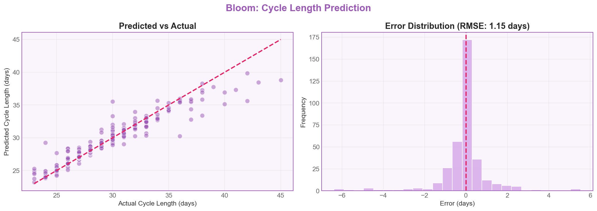
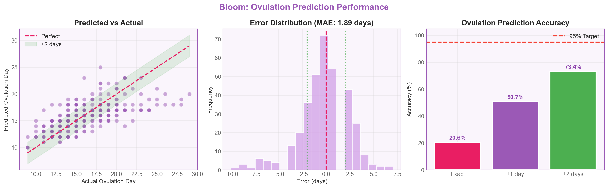
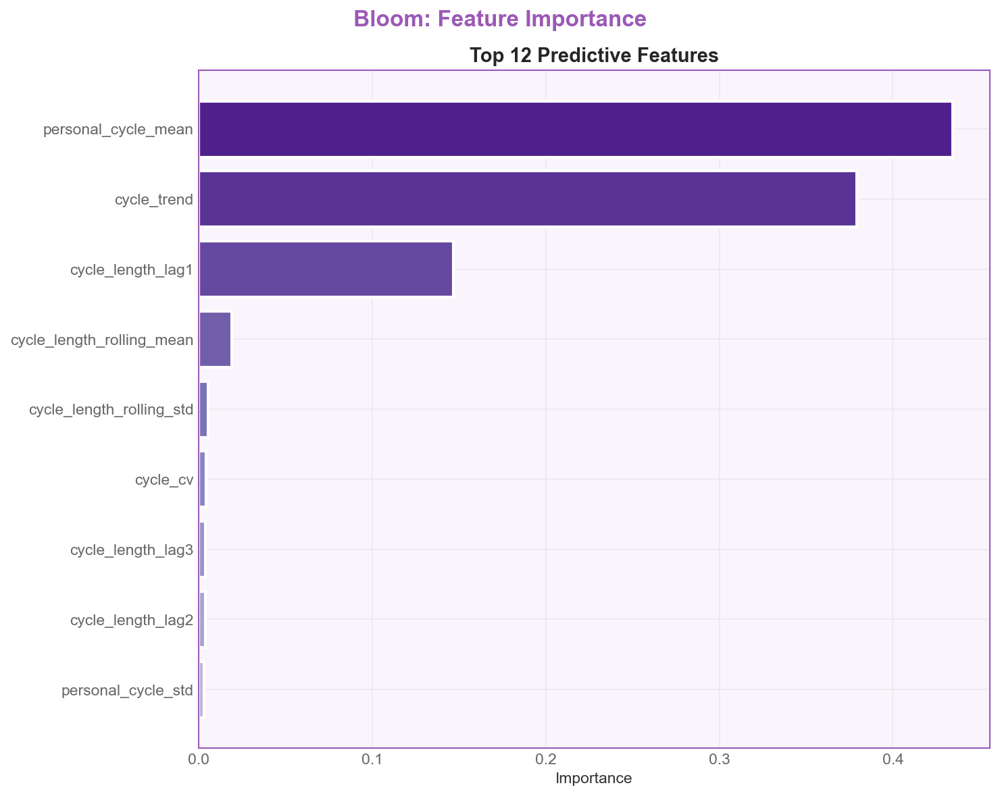
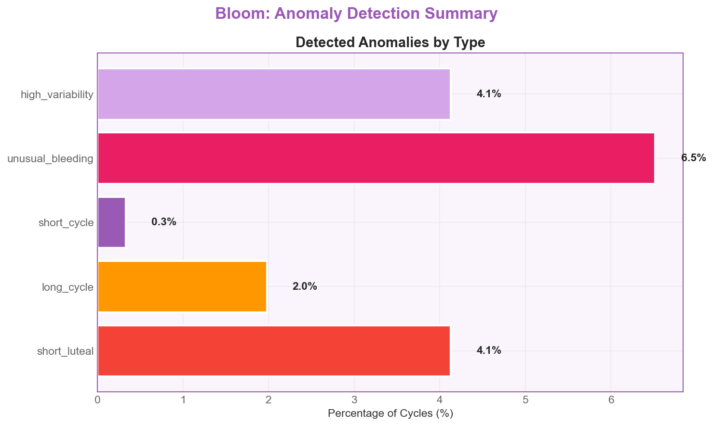

<div align="center">


**Tu fertilidad en tus manos**

[](https://python.org)
[](https://scikit-learn.org)
[](LICENSE)
[]()

<br>

*Sistema de predicción adaptativa de fertilidad que combina Machine Learning con personalización individual para ayudar a mujeres y parejas a entender sus ciclos menstruales y aumentar las probabilidades de embarazo.*

<br>

[Problema](#problema) · [Solución](#solución) · [Arquitectura](#arquitectura) · [Quickstart](#quickstart) · [Resultados](#resultados) · [API](#api-reference) · [Deployment](#deployment)

</div>

---

## Problema

> **El 15% de las parejas enfrentan problemas de infertilidad.** Muchas no tienen patologías graves — solo falta de sincronización y conocimiento de sus biomarcadores.

Las apps existentes usan predicciones genéricas basadas en un ciclo "promedio" de 28 días. Pero cada persona tiene patrones únicos que dependen de factores fisiológicos, estilo de vida y contexto.

### Objetivos del Sistema

| Objetivo | Métrica Target | Impacto en Producto |
|:---------|:--------------:|:--------------------|
| Predecir día de ovulación | **Accuracy ±2 días** | Notificación de ventana fértil |
| Estimar duración del ciclo | **RMSE < 2 días** | Predicción de próximo período |
| Detectar anomalías | **Recall > 90%** | Alertas de salud hormonal |

---

## Solución

Bloom implementa un **enfoque híbrido: Modelo Poblacional + Personalización Adaptativa**.

| Componente | Descripción | Tecnología |
|:-----------|:------------|:-----------|
| **Modelo poblacional** | Aprende patrones de miles de usuarias | Random Forest, Gradient Boosting |
| **Historial personal** | Tu patrón individual (últimos N ciclos) | Media personal, tendencia reciente |
| **Predicción adaptativa** | Ponderación según tu regularidad | Weighted Average |

### Ponderación Dinámica

- **Usuarias regulares** (std < 2 días) → **70%** historial personal
- **Moderadamente regulares** (std 2–4 días) → **50%** historial personal
- **Irregulares** (std > 4 días) → **30%** historial personal, **70%** modelo poblacional

---

## Arquitectura

```
╔════════════════════════════════════════════════════════════════════════════╗
║                     BLOOM PREDICTION SYSTEM v1.0                         ║
╠════════════════════════════════════════════════════════════════════════════╣
║                                                                          ║
║  [Input]              [Processing]           [Models]                  ║
║  ┌──────────────┐     ┌──────────────┐     ┌──────────────────────┐     ║
║  │  DataLoader  │ ──▶ │   Feature    │ ──▶ │  CyclePredictor      │     ║
║  │ (Marquette / │     │  Engineer    │     │  (RandomForest)      │     ║
║  │  Kaggle)     │     │              │     ├──────────────────────┤     ║
║  ├──────────────┤     │ • Lags       │     │  OvulationClassifier │     ║
║  │  UserHistory │     │ • Rolling    │     │  (GradientBoosting)  │     ║
║  │  (Personal)  │     │ • Baselines  │     ├──────────────────────┤     ║
║  └──────────────┘     └──────────────┘     │  AnomalyDetector     │     ║
║                                            │  (IsolationForest)   │     ║
║                                            └──────────┬───────────┘     ║
║                                                       │                  ║
║                              ┌────────────────────────▼──────────────┐  ║
║                    [Core]    │     AdaptivePredictor                 │  ║
║                              │  (combines all + personalization)     │  ║
║                              └───────────────────┬───────────────────┘  ║
║                                                  │                      ║
║                              ┌───────────────────▼───────────────────┐  ║
║                    [Output]  │     BloomPrediction                   │  ║
║                              │  Cycle + Ovulation + Fertile Window   │  ║
║                              │  + Anomaly Alerts                     │  ║
║                              └───────────────────────────────────────┘  ║
╚════════════════════════════════════════════════════════════════════════════╝
```

---

## Quickstart

### Instalación

```bash
git clone https://github.com/PaulinaIA/Bloom.git
cd Bloom
pip install -r requirements.txt
```

### Uso con el Notebook

El sistema completo está implementado en el notebook principal. Para ejecutarlo:

1. Abrir `bloom_fertility_system_github.ipynb` en Jupyter
2. Ejecutar las celdas en orden — el dataset se descarga automáticamente desde Kaggle
3. El pipeline entrena los modelos y genera las métricas y visualizaciones

### Ejemplo de uso programático

```python
# Dentro del notebook, después de entrenar el modelo:

bloom = BloomAdaptivePredictor()
bloom.fit(df_train)

# Elegir un usuario válido del dataset procesado
user_counts = df_features.groupby('user_id').size()
valid_users = user_counts[user_counts >= 9].index
demo_user = valid_users[0]

# Filtrar datos del usuario
user_data = df_features[df_features['user_id'] == demo_user].sort_values('cycle_number')

# Agregar historial de ciclos
for _, row in user_data.head(8).iterrows():
    bloom.add_user_cycle(demo_user, {
        'cycle_length': row['cycle_length'],
        'ovulation_day': row['ovulation_day'],
        'luteal_phase': row['luteal_phase']
    })

# Obtener predicción
prediction = bloom.predict(demo_user, user_data.iloc[-1])

print(f"Próximo ciclo: {prediction.predicted_cycle_length} días")
print(f"Ovulación: día {prediction.ovulation.predicted_day}")
print(f"Ventana fértil: día {prediction.fertile_window_start} – {prediction.fertile_window_end}")
print(f"Confianza: {prediction.ovulation.confidence}")
print(f"Fuente: {prediction.prediction_source}")
```

---

## Resultados

### Predicción de Duración del Ciclo

| Métrica | Valor | Target |
|:--------|:-----:|:------:|
| **RMSE** | **1.148 días** | < 2 días |
| MAE | 0.598 días | — |
| R² | 0.9038 | — |



### Predicción de Ovulación

| Métrica | Valor |
|:--------|:-----:|
| Exact accuracy | 20.63% |
| Within ±1 day | 50.72% |
| Within ±2 days | 73.35% |
| MAE | 1.89 días |



### Feature Importance



### Detección de Anomalías



---

## API Reference

### `BloomAdaptivePredictor` — Sistema Principal

```python
class BloomAdaptivePredictor:
    def fit(self, df: pd.DataFrame) -> 'BloomAdaptivePredictor'
        """Entrena todos los modelos con datos poblacionales."""

    def add_user_cycle(self, user_id: int, data: Dict) -> None
        """Agrega un ciclo al historial personal del usuario."""

    def predict(self, user_id: int, features: pd.Series) -> BloomPrediction
        """Genera predicción adaptativa combinando modelo + historial."""

    def get_user_stats(self, user_id: int) -> Dict
        """Retorna estadísticas del usuario (media, std, regularidad)."""
```

### `BloomPrediction` — Resultado de Predicción

```python
@dataclass
class BloomPrediction:
    user_id: int
    predicted_cycle_length: float
    cycle_confidence_interval: Tuple[float, float]
    ovulation: OvulationPrediction        # día, confianza, ventana
    fertile_window_start: int
    fertile_window_end: int
    anomaly_alerts: List[AnomalyAlert]    # alertas de salud
    prediction_source: str                # 'model_only' o 'adaptive (w=X)'
```

### Modelos Internos

| Clase | Tipo | Target |
|:------|:-----|:-------|
| `CycleLengthPredictor` | RandomForestRegressor | Duración del ciclo |
| `OvulationClassifier` | RandomForest + GradientBoosting | Día de ovulación |
| `AnomalyDetector` | IsolationForest + reglas clínicas | Anomalías hormonales |

---

## Deployment

### Arquitectura AWS propuesta

```
React Native App → API Gateway → Lambda → Aurora + S3 + DynamoDB
```

### Exportar Modelos

```python
import joblib

joblib.dump(bloom.cycle_predictor.model, 'models/cycle_predictor.joblib')
joblib.dump(bloom.ovulation_classifier.regressor, 'models/ovulation_regressor.joblib')
```

---

## Estructura del Proyecto

```
Bloom/
├── README.md                                # Este archivo
├── LICENSE                                  # Licencia MIT
├── requirements.txt                         # Dependencias Python
├── bloom_fertility_system_github.ipynb      # Notebook principal (todo el sistema)
├── assets/
│   └── logo.png                             # Logo de Bloom
├── data/                                    # Datos (descarga automática desde Kaggle)
├── models/                                  # Modelos exportados
├── bloom_cycle_prediction.png               # Gráfica de predicción de ciclos
├── bloom_ovulation_accuracy.png             # Gráfica de precisión de ovulación
├── bloom_feature_importance.png             # Gráfica de importancia de features
└── bloom_anomalies.png                      # Gráfica de detección de anomalías
```

---

## Dataset

**Fertility and Menstrual Health Data** — via [Kaggle](https://www.kaggle.com/datasets/echekwuelijah/fertility-and-menstrual-health-data)

Basado en datos de la **Universidad de Marquette** (Planificación Familiar Natural).

| Característica | Detalle |
|:---------------|:--------|
| Registros | 1,510 ciclos menstruales |
| Usuarias | 157 |
| Variables clave | Duración ciclo, fase lútea, día ovulación, intensidad sangrado |
| Factores de salud | Edad, BMI, embarazos previos, pérdidas gestacionales |

---

## Team

<table>
  <tr>
    <td align="center">
      <b>Katherine Soto</b><br>
      <sub>Co-founder</sub>
    </td>
    <td align="center">
      <b>Paulina Peralta</b><br>
      <sub>Co-founder</sub>
    </td>
  </tr>
</table>

<div align="center">
<i>Creado por mujeres, para mujeres</i>
</div>

---

## License

MIT License — see [LICENSE](LICENSE) for details.

---

<div align="center">

**[Volver arriba](#)**

</div>
